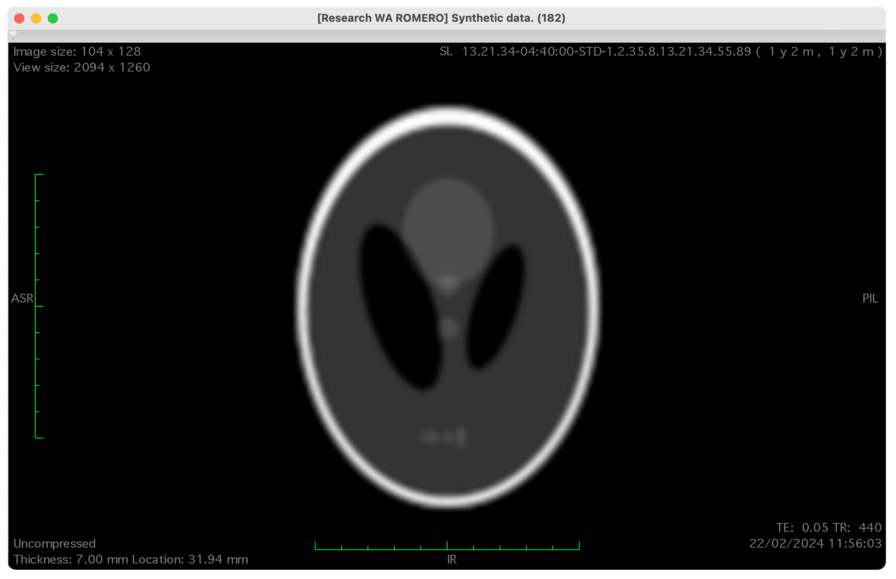

# DICOM Image Unit Test

`igpokt` is one of the key packages in all our image processing workflows. One of the developers has reported an issue with the unit test of the `DcmImage` class (`dcm` module):

```
$ python .\test_DcmImage.py

======================================================================
FAIL: test_slice_location (__main__.TestDcmImage)
----------------------------------------------------------------------
Traceback (most recent call last):
  File ".\test_DcmImage.py", line 34, in test_slice_location
    self.assertEqual(dicomImage.SliceLocation, 31.9425961863641)
AssertionError: '14.26368418681' != 31.9425961863641

----------------------------------------------------------------------
Ran 1 test in 0.006s
```

Test data have been checked and are correct:



### How would you identify the problem?

- Describe the process you will follow. 
- Is the code provided enough to understand the problem?
- Could you write a few lines of code to verify and support your conclusion?